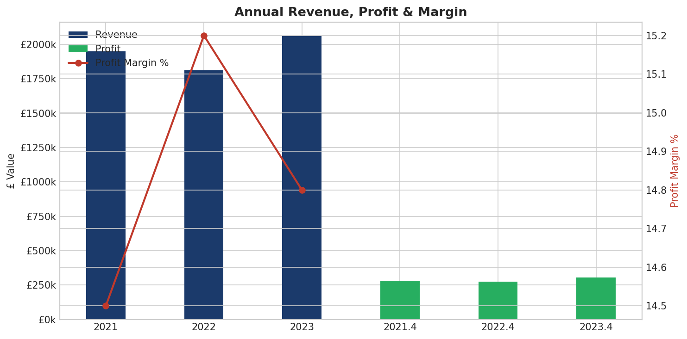
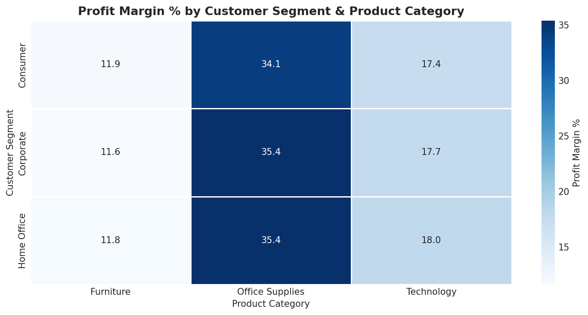

# UK Retail Sales Analysis with SQL & Python

### Relational Database Design · SQL Querying · Business Insight Visualisation


---

## Project Overview

This project demonstrates the full workflow of a data analyst working with relational databases: designing a schema, populating it with realistic data, and extracting business insights using progressively complex SQL queries - all within Python.

A synthetic UK retail dataset is generated inside the notebook (no downloads required), loaded into a **SQLite** relational database, and analysed using **10 SQL queries** covering everything from basic aggregations to window functions and CTEs.

# Key Visualizations
**Annual Revenue & Profit Margin**


**Profit Margin by Segment & Category**

---

## Database Schema

Four related tables in **3rd Normal Form (3NF)**:

```
customers ──< orders ──< order_items >── products
```

| Table | Columns | Description |
|---|---|---|
| `customers` | customer_id, name, city, region, segment | 300 UK customers |
| `products` | product_id, name, category, sub_category, unit_price | 25 products across 3 categories |
| `orders` | order_id, customer_id, order_date, ship_date, ship_mode | 3,000 orders (2021–2023) |
| `order_items` | item_id, order_id, product_id, qty, discount, sales, profit | Individual line items |

---

##  SQL Queries Demonstrated

| # | Query | SQL Technique |
|---|---|---|
| Q1 | Annual revenue, profit & margin | `JOIN`, `GROUP BY`, date functions |
| Q2 | Performance by product category | Multi-table `JOIN`, computed columns |
| Q3 | Top 10 customers by lifetime value | 3-table `JOIN`, string concat, `LIMIT` |
| Q4 | Regional performance with margin banding | `CASE WHEN` conditional classification |
| Q5 | Products above average sales | Scalar subquery in `HAVING` |
| Q6 | Monthly revenue + running total | `SUM() OVER` cumulative window + CTE |
| Q7 | Customer ranking per region | `RANK() OVER (PARTITION BY)` |
| Q8 | Month-over-month growth | `LAG()` window function + chained CTEs |
| Q9 | Best product per category | Correlated subquery |
| Q10 | Segment × category profitability heatmap | 4-table `JOIN`, multi-level `GROUP BY` |

---

##  Tech Stack

- **Python 3.10**
- **sqlite3** (Python standard library) - database creation and querying
- **pandas** - `read_sql_query()` to load SQL results into DataFrames
- **Matplotlib / Seaborn** - visualising query results
- **NumPy** - data generation

> No external database installation needed - SQLite runs entirely within Python.

---

## How to Run

### Easiest: Google Colab (no setup required)

[](https://colab.research.google.com/github/KaveenKK/sql-retail-analysis/blob/main/sql_retail_analysis.ipynb)

The notebook generates its own dataset on first run - nothing to download.

### Local

```bash
git clone https://github.com/KaveenKK/sql-retail-analysis.git
cd sql-retail-analysis
pip install -r requirements.txt
jupyter notebook sql_retail_analysis.ipynb
```

---

## Repository Structure

```
sql-retail-analysis/
│
|__ sql_retail_analysis.ipynb   # Full analysis notebook
|__ requirements.txt             # Python dependencies
|__ README.md                    # This file
|__ sql_queries                  #Folder containing the 10 extracted SQL queries used for analysis.
|__ uk_retail.db                 #The final SQLite database generated by the script.
```

---

## Key Business Findings

- **Technology** drives the highest revenue but has the thinnest margins - Office Supplies is the most profitable category relative to revenue
- **Corporate** customers have the highest average order value across all regions
- **London and the South East** lead on total revenue, though margin bands are competitive in other regions
- Revenue shows clear **seasonal patterns**, peaking in Q3/Q4
- **Discounts above 20%** consistently reduce profitability - a key insight for pricing strategy

---

## Future Extensions

- Port queries to **Microsoft SQL Server** or **PostgreSQL**
- Build a **Power BI dashboard** consuming the same queries
- Add **stored procedures** and **views** to the schema
- Apply **cohort analysis** to measure customer retention
- Use **SQLAlchemy** for production-grade ORM connections

---

## Author

**Kaveen Kodikarage**  
BSc (Hons) Computing Systems - Ulster University  
📧 kaveenyasas14@gmail.com
